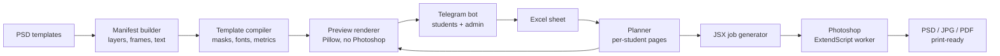

# Yearbook Autofill

**Print-production automation for a graduation album studio. It fills Photoshop templates from Excel, builds a personal PDF yearbook for every student, and lets students pick their own photos and pages in a Telegram bot.**


> Used in production by a studio that makes school graduation albums and "vignettes" (personal yearbooks).

---

## The problem

One class means 25–30 students, each with a personal cover, a class grid, teacher pages, quotes and group photos they chose. Designers placed hundreds of photos and names by hand in Photoshop for every class, and every "please change my photo" meant redoing pages.

## What it does

**1. Album autofill (Excel → Photoshop)**
- A designer fills an Excel sheet: names, quotes, teachers and photo file names per frame. A template scheme image shows which number goes where.
- Python parses the PSD template into a **layer manifest** and generates an **ExtendScript (JSX) job** that Photoshop runs headlessly.
- Photos are fitted into frames (cover-fit, face-friendly vertical bias) as **clipping masks**, so the frame's shape and effects are kept.
- Text is replaced **in the same layer**, keeping font, color, rotation and mixed per-word styles, and is auto-shrunk (down to 60%) when it doesn't fit.
- Output per page: layered PSD, JPG and PDF. Source templates are never modified. A `--check` dry run validates everything without Photoshop.

**2. Personal yearbooks (one PDF per student)**
- Each student gets `<Class>/<Last First>.pdf`: a personal cover plus the class pages and the group-photo pages they selected.
- Identical pages render once (cache), and reruns only build what changed.
- **Watermarked previews without Photoshop** in seconds: templates are pre-compiled into layer images, masks and text metrics and rendered with Pillow and fontTools. This makes it possible to run on a Linux VPS.

**3. Telegram bot for students and the studio**
- Students join with a class invite link, enter their name, choose extra pages within the class tariff, choose frames for cover and grid (the bot shows the frame to confirm), add a quote and choose group photos.
- When the whole class is done, everyone gets a **PDF preview** with "Approve" or "Change" buttons.
- The studio admin creates classes, tracks progress (filled/approved), sends reminders, exports the print sheet as xlsx and starts the final build.

## Architecture



## Tech stack

`Python 3` · `Adobe Photoshop ExtendScript (JSX)` · `openpyxl` · `Pillow` · `fontTools` · `aiogram 3` · `SQLite` · `pytest` (142 tests in public build)

## Engineering highlights

- A Python ↔ Photoshop bridge: JSON job → generated ES3-safe `run.jsx` → Photoshop worker reports through `progress.log` and `result.json`, with a completion marker the Python side waits on.
- Template-agnostic: page roles (cover, grid, teachers, group photos) are declared in JSON configs. Adding a new album design means writing a config, not code.
- Grid variants adapt automatically to class size.
- A year written once is formatted into each template's styles ("2025", "20 / 25", "'25").

> ⚠️ **Code only.** This repository contains no design materials: the album templates (PSD), fonts, studio branding and everything extracted from the templates (page configs, layouts, layer manifests, compiled preview assets, Excel templates) are not included. To use it, add your own PSD templates and generate the data with `build_manifests.py` and `vignette.py compile`. Tests that need template data are skipped automatically (142 run, 32 skipped).

## Quick start

```bash
pip install openpyxl pillow fonttools aiogram pytest
pytest
python fill_album.py --template <Template> --excel class.xlsx --photos ./photos --out ./out --check
python vignette.py preview --template <Template> --excel class.xlsx --photos ./photos --out ./out
```

---

📄 Detailed user documentation (Russian): [README.ru.md](README.ru.md)

💼 Need Photoshop/InDesign automation, data merge or print-production tooling? **[Hire me on Upwork](https://www.upwork.com/freelancers/~01b79ffa28442df3f8)**
